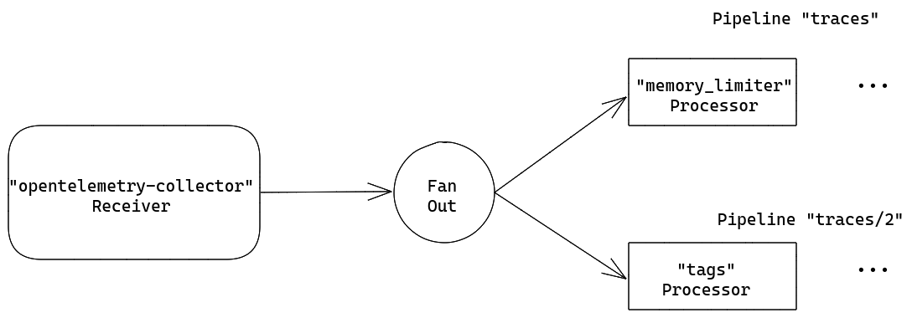
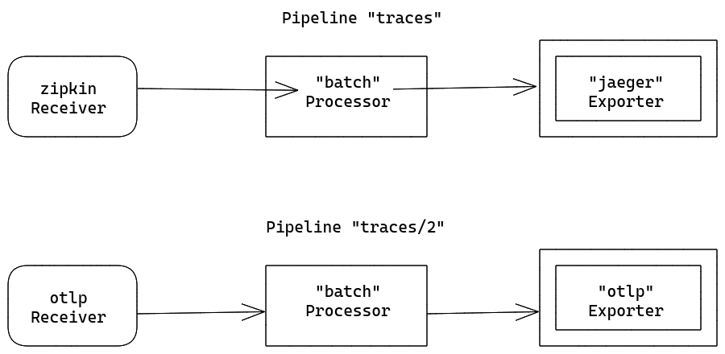

# OpenTelemetry Collector Architecture

This document describes the architecture design and implementation of
OpenTelemetry Collector.

## Summary

OpenTelemetry Collector is an executable that allows to receive telemetry data, optionally transform it and send the data further.

The Collector supports several popular open-source protocols for telemetry data receiving and sending as well as offering a pluggable architecture for adding more protocols.

Data receiving, transformation and sending is done using Pipelines. The Collector can be configured to have one or more Pipelines. Each Pipeline includes a set of Receivers that receive the data, a series of optional Processors that get the data from receivers and transform it and a set of Exporters which get the data from the Processors and send it further outside the Collector. The same receiver can feed data to multiple Pipelines and multiple pipelines can feed data into the same Exporter.

## Pipelines

Pipeline defines a path the data follows in the Collector starting from reception, then further processing or modification and finally exiting the Collector via exporters.

Pipelines can operate on 2 telemetry data types: traces and metrics. The data type is a property of the pipeline defined by its configuration. Receivers, exporters and processors used in a pipeline must support the particular data type otherwise `ErrDataTypeIsNotSupported` will be reported when the configuration is loaded. A pipeline can be depicted the following way:


There can be one or more receivers in a pipeline. Data from all receivers is pushed to the first processor, which performs a processing on it and then pushes it to the next processor (or it may drop the data, e.g. if it is a “sampling” processor) and so on until the last processor in the pipeline pushes the data to the exporters. Each exporter gets a copy of each data element. The last processor uses a `FanOutConnector` to fan out the data to multiple exporters.

The pipeline is constructed during Collector startup based on pipeline definition in the config file.

A pipeline configuration typically looks like this:

```yaml
service:
  pipelines: # section that can contain multiple subsections, one per pipeline
    traces:  # type of the pipeline
      receivers: [opencensus, jaeger, zipkin]
      processors: [tags, tail_sampling, batch, queued_retry]
      exporters: [opencensus, jaeger, stackdriver, zipkin]
```

The above example defines a pipeline for “traces” type of telemetry data, with 3 receivers, 4 processors and 4 exporters.

For details of config file format see [this document](https://docs.google.com/document/d/1GWOzV0H0RTN1adiwo7fTmkjfCATDDFGuOB4jp3ldCc8/edit#).

### Receivers

Receivers typically listen on a network port and receive telemetry data. Usually one receiver is configured to send received data to one pipeline, however it is also possible to configure the same receiver to send the same received data to multiple pipelines. This can be done by simply listing the same receiver in the “receivers” key of several pipelines:

```yaml
receivers:
  opencensus:
    endpoint: "localhost:55678"

service:
  pipelines:
    traces:  # a pipeline of “traces” type
      receivers: [opencensus]
      processors: [tags, tail_sampling, batch, queued_retry]
      exporters: [jaeger]
    traces/2:  # another pipeline of “traces” type
      receivers: [opencensus]
      processors: [batch]
      exporters: [opencensus]
```

In the above example “opencensus” receiver will send the same data to pipeline “traces” and to pipeline “traces/2”. (Note: the configuration uses composite key names in the form of `type[/name]` as defined in [this document](https://docs.google.com/document/d/1GWOzV0H0RTN1adiwo7fTmkjfCATDDFGuOB4jp3ldCc8/edit#)).

When the Collector loads this config the result will look like this (part of processors and exporters are omitted from the diagram for brevity):



Important: when the same receiver is referenced in more than one pipeline the Collector will create only one receiver instance at runtime that will send the data to `FanOutConnector` which in turn will send the data to the first processor of each pipeline. The data propagation from receiver to `FanOutConnector` and then to processors is via synchronous function call. This means that if one processor blocks the call the other pipelines that are attached to this receiver will be blocked from receiving the same data and the receiver itself will stop processing and forwarding newly received data.

### Exporters

Exporters typically forward the data they get to a destination on a network (but they can also send it elsewhere, e.g “logging” exporter writes the telemetry data to a local file).

The configuration allows to have multiple exporters of the same type, even in the same pipeline. For example one can have 2 “opencensus” exporters defined each one sending to a different opencensus endpoint, e.g.:

```yaml
exporters:
  opencensus/1:
    endpoint: "example.com:14250"
  opencensus/2:
    endpoint: "localhost:14250"
```

Usually an exporter gets the data from one pipeline, however it is possible to configure multiple pipelines to send data to the same exporter, e.g.:

```yaml
exporters:
  jaeger:
    protocols:
      grpc:
        endpoint: "localhost:14250"

service:
  pipelines:
    traces:  # a pipeline of “traces” type
      receivers: [zipkin]
      processors: [tags, tail_sampling, batch, queued_retry]
      exporters: [jaeger]
    traces/2:  # another pipeline of “traces” type
      receivers: [opencensus]
      processors: [batch]
      exporters: [jaeger]
```

In the above example “jaeger” exporter will get data from pipeline “traces” and from pipeline “traces/2”. When the Collector loads this config the result will look like this (part of processors and receivers are omitted from the diagram for brevity):


### Processors

A pipeline can contain sequentially connected processors. The first processor gets the data from one or more receivers that are configured for the pipeline, the last processor sends the data to one or more exporters that are configured for the pipeline. All processors between the first and last receive the data strictly only from one preceding processor and send data strictly only to the succeeding processor.

The traces pipeline must have at least one processor. Metrics pipeline does not require processors since we currently do not have any implemented metrics processors yet.

Processors can transform the data before forwarding it (i.e. add or remove attributes from spans), they can drop the data simply by deciding not to forward it (this is for example how “sampling” processor works), they can also generate new data (this is how for example how a “persistent-queue” processor can work after Collector restarts by reading previously saved data from a local file and forwarding it on the pipeline).

The same name of the processor can be referenced in the “processors” key of multiple pipelines. In this case the same configuration will be used for each of these processors however each pipeline will always gets its own instance of the processor. Each of these processors will have its own state, the processors are never shared between pipelines. For example if “queued_retry” processor is used several pipelines each pipeline will have its own queue (although the queues will be configured exactly the same way if the reference the same key in the config file). As an example, given the following config:

```yaml
processors:
  queued_retry:
    size: 50
    per-exporter: true
    enabled: true

service:
  pipelines:
    traces:  # a pipeline of “traces” type
      receivers: [zipkin]
      processors: [queued_retry]
      exporters: [jaeger]
    traces/2:  # another pipeline of “traces” type
      receivers: [opencensus]
      processors: [queued_retry]
      exporters: [opencensus]
```

When the Collector loads this config the result will look like this:



Note that each “queued_retry” processor is an independent instance, although both are configured the same way, i.e. each have a size of 50.

## <a name="opentelemetry-agent"></a>Running as an Agent

On a typical VM/container, there are user applications running in some
processes/pods with OpenTelemetry Library (Library). Previously, Library did
all the recording, collecting, sampling and aggregation on spans/stats/metrics,
and exported them to other persistent storage backends via the Library
exporters, or displayed them on local zpages. This pattern has several
drawbacks, for example:

1. For each OpenTelemetry Library, exporters/zpages need to be re-implemented
   in native languages.
2. In some programming languages (e.g Ruby, PHP), it is difficult to do the
   stats aggregation in process.
3. To enable exporting OpenTelemetry spans/stats/metrics, application users
   need to manually add library exporters and redeploy their binaries. This is
   especially difficult when there’s already an incident and users want to use
   OpenTelemetry to investigate what’s going on right away.
4. Application users need to take the responsibility in configuring and
   initializing exporters. This is error-prone (e.g they may not set up the
   correct credentials\monitored resources), and users may be reluctant to
   “pollute” their code with OpenTelemetry.

To resolve the issues above, you can run OpenTelemetry Collector as an Agent.
The Agent runs as a daemon in the VM/container and can be deployed independent
of Library. Once Agent is deployed and running, it should be able to retrieve
spans/stats/metrics from Library, export them to other backends. We MAY also
give Agent the ability to push configurations (e.g sampling probability) to
Library. For those languages that cannot do stats aggregation in process, they
should also be able to send raw measurements and have Agent do the aggregation.

TODO: update the diagram below.


For developers/maintainers of other libraries: Agent can also
accept spans/stats/metrics from other tracing/monitoring libraries, such as
Zipkin, Prometheus, etc. This is done by adding specific receivers. See
[Receivers](#receivers) for details.

## <a name="opentelemetry-collector"></a>Running as a Standalone Collector

The OpenTelemetry Collector can run as a Standalone instance and receives spans
and metrics exported by one or more Agents or Libraries, or by
tasks/agents that emit in one of the supported protocols. The Collector is
configured to send data to the configured exporter(s). The following figure
summarizes the deployment architecture:

TODO: update the diagram below.


The OpenTelemetry Collector can also be deployed in other configurations, such
as receiving data from other agents or clients in one of the formats supported
by its receivers.


### <a name="agent-communication"></a>OpenCensus Protocol

TODO: move this section somewhere else since this document is intended to describe non-protocol specific functionality.

OpenCensus Protocol uses a bi-directional gRPC
stream. Sender should initiate the connection, since there’s only one
dedicated port for Agent, while there could be multiple instrumented processes. By default, the Collector is available on port 55678.

#### <a name="agent-protocol-workflow"></a>Protocol Workflow

1. Sender will try to directly establish connections for Config and Export
   streams.
2. As the first message in each stream, Sender must send its identifier. Each
   identifier should uniquely identify Sender within the VM/container. If
   there is no identifier in the first message, Collector should drop the whole
   message and return an error to the client. In addition, the first message
   MAY contain additional data (such as `Span`s). As long as it has a valid
   identifier associated, Collector should handle the data properly, as if they
   were sent in a subsequent message. Identifier is no longer needed once the
   streams are established.
3. On Sender side, if connection to Collector failed, Sender should retry
   indefintely if possible, subject to available/configured memory buffer size.
   (Reason: consider environments where the running applications are already
   instrumented with OpenTelemetry Library but Collector is not deployed yet.
   Sometime in the future, we can simply roll out the Collector to those
   environments and Library would automatically connect to Collector with
   indefinite retries. Zero changes are required to the applications.)
   Depending on the language and implementation, retry can be done in either
   background or a daemon thread. Retry should be performed at a fixed
   frequency (rather than exponential backoff) to have a deterministic expected
   connect time.
4. On Collector side, if an established stream were disconnected, the identifier of
   the corresponding Sender would be considered expired. Sender needs to
   start a new connection with a unique identifier (MAY be different than the
   previous one).
